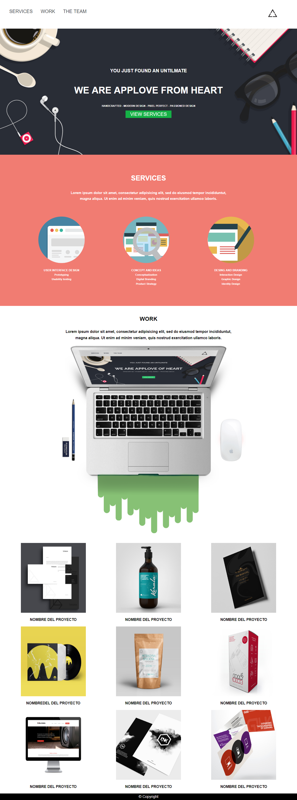

# EJERCICIO : Applove

  El presente  trabajo da a conocer los conocimientos impartidos en clase sobre "Maquetado web con HTML & CSS"

**Objetivo:**
 - Replicar la web Applove.

 

**Proceso:**

- Para completar dicho  ejercicio contaremos con  un repositorio boilerplate (plantilla inicial) con todos los recursos necesarios
